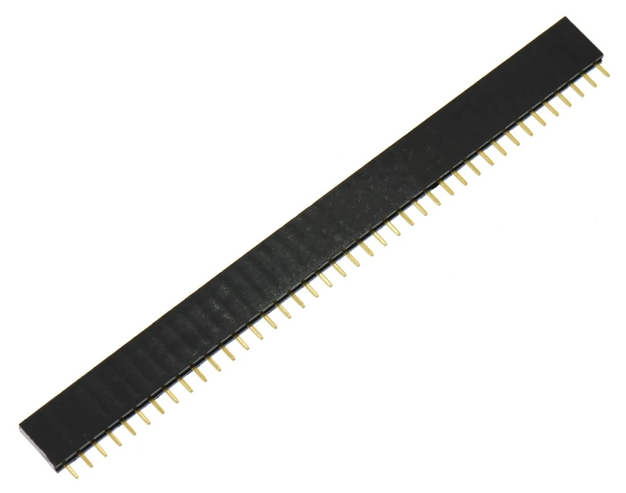
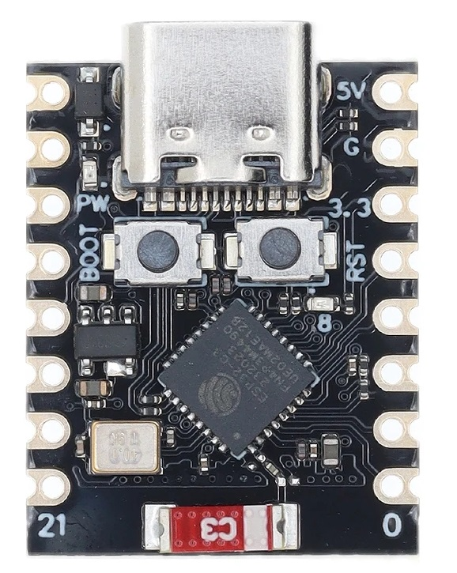
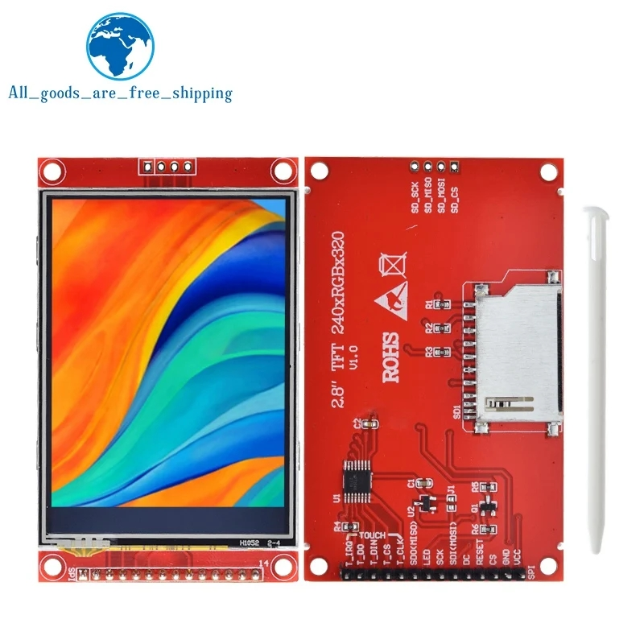
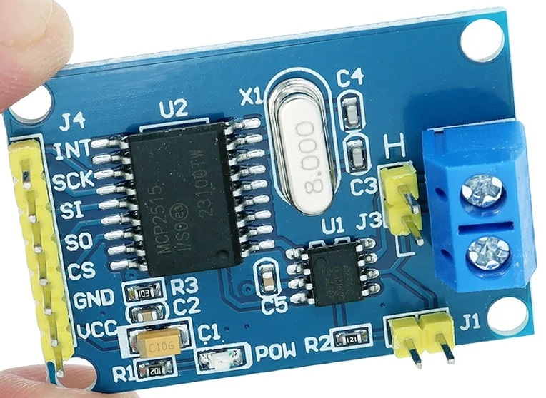
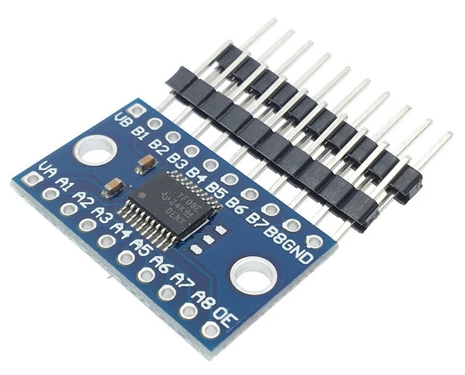
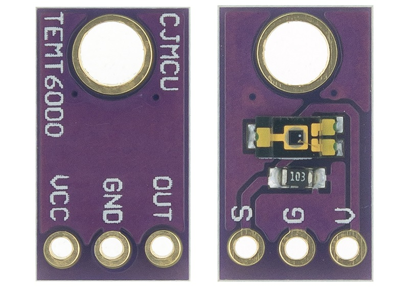
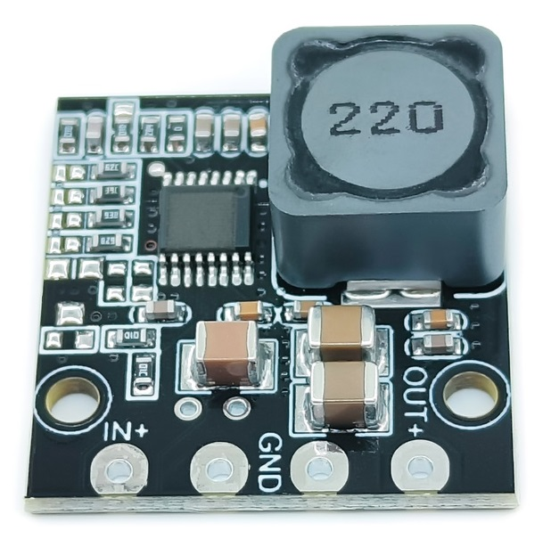

# PCB

Use your favorite PCB manufacturer to upload **CanBus.zip** and create your PCB. I use JLCPCB (select Global shipping for ultra cheap shipping) but you can use whoever you like.

## Files

**CanBus.zip** has been provided for your convenience. It contains everything you need to have the PCB manufactured.
**CarCan** folder has the KiCad project and all the necessary files for you to modify it however you please.

## Parts Required
The following parts are needed:
* 10x 2.54mm 40pin Headers, cut to side 

* 1x ESP32 C3 Supermini 

* 1x 2.8" LCD ILI9341 w SD (Touch optional but you might as well get it as it isn't much extra) 

* 1x MCP2515 Can Bus Module 

* 1x YF08E Level Shifter Module 

* 1x TEMT6000 Light Sensor Module 

* 1x DC-DC Step Down Power Supply 

