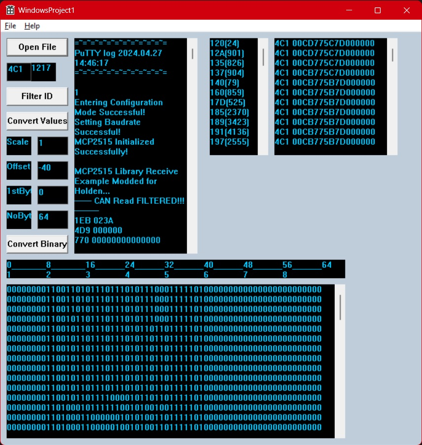

# Visual Studio Helper Programs

These are programs to help decode Can Bus messages and convert bitmaps to Arduino CPP code.

## Projects

* **BMP2CPP** Converts bitmaps to Arduino CPP code.
* **CanBusSniffer-Walker** Reads in recorded CanBus messages and helps decode messages. 

