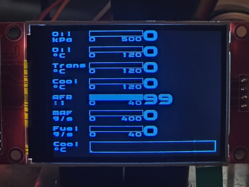

# Holden VE/VF Digital CANBUS Display

**!!STILL UNDER DEVELOPMENT!!**

## About

This project reads high speed GM CanBus messages from the OBDII Port on Holden VE/VF/WN/WM Commodores including extended PIDs and displays the information on an LCD Touch Screen using gauges and graphs. Logging functionality will be added once I have parts.

## Folders

**PCB** It contains everything you need to have the custom PCB manufactured.
**Arduino** Contains the main project.
**Visual Studio** Helper programs if you want to start decoding more of the high speed CanBus messages or if you want to import your own graphics.

## Code

The code is still under development but should work.

This is a follow on from my previous GitHub https://github.com/alm4096/Holden-OBD2-Extended-PIDs

## Hardware Required

The following parts are needed:
* 10x 2.54mm 40pin Headers, cut to side

* 1x ESP32 C3 Supermini

* 1x 2.8" LCD ILI9341 w SD (Touch optional but you might as well get it as it isn't much extra)

* 1x MCP2515 Can Bus Module

* 1x YF08E Level Shifter Module

* 1x TEMT6000 Light Sensor Module

* 1x DC-DC Step Down Power Supply

